# 🏗️ Architecture Overview

This document provides a comprehensive overview of the Intelligent Research Assistant's system architecture, including component interactions, data flow, and design decisions.

## 📋 **Table of Contents**

- [System Overview](#system-overview)
- [High-Level Architecture](#high-level-architecture)
- [Component Architecture](#component-architecture)
- [Data Flow](#data-flow)
- [Multi-Agent System](#multi-agent-system)
- [Security Architecture](#security-architecture)
- [Deployment Architecture](#deployment-architecture)
- [Performance Considerations](#performance-considerations)

---

## 🎯 **System Overview**

The Intelligent Research Assistant is built as a **microservices architecture** with the following key characteristics:

- **Modular Design**: Each component is independently deployable and scalable
- **Event-Driven**: Components communicate through well-defined APIs and events
- **Security-First**: Enterprise-grade security at every layer
- **AI-Native**: Built specifically for AI/ML workloads and fine-tuning
- **Cloud-Ready**: Designed for cloud deployment with containerization

## 🏗️ **High-Level Architecture**

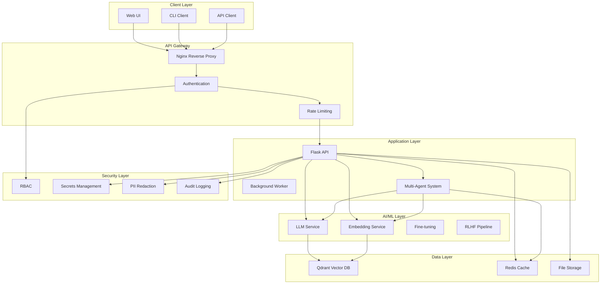

## 🔧 **Component Architecture**

### **1. Web Interface (Flask)**

```mermaid
graph LR
    subgraph "Flask Application"
        ROUTES[API Routes]
        MIDDLEWARE[Middleware]
        SERVICES[Service Layer]
        MODELS[Data Models]
    end
    
    subgraph "API Endpoints"
        UPLOAD[/upload]
        CHAT[/chat]
        SEARCH[/search]
        AGENTS[/agents]
        ADMIN[/admin]
    end
    
    subgraph "Middleware"
        AUTH_MW[Auth Middleware]
        RATE_MW[Rate Limiting]
        LOG_MW[Logging]
        CORS_MW[CORS]
    end
    
    ROUTES --> MIDDLEWARE
    MIDDLEWARE --> SERVICES
    SERVICES --> MODELS
```

**Key Components:**
- **API Routes**: RESTful endpoints for all operations
- **Middleware Stack**: Authentication, rate limiting, logging, CORS
- **Service Layer**: Business logic and orchestration
- **Data Models**: Pydantic models for validation

### **2. Multi-Agent Orchestration**

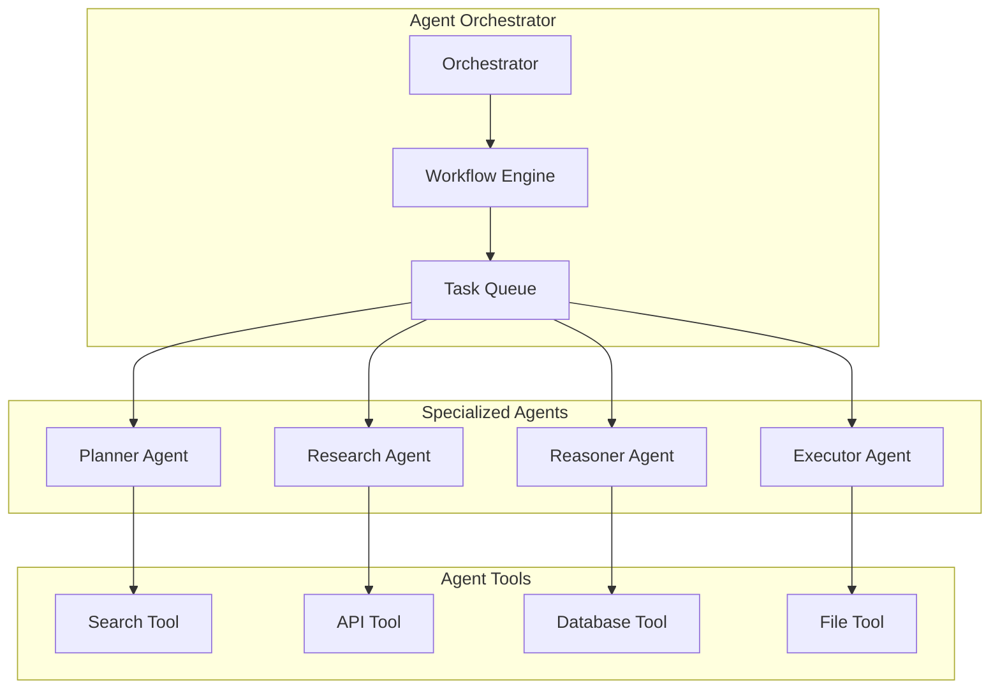

**Agent Responsibilities:**
- **Planner**: Task decomposition and workflow planning
- **Research**: Information retrieval and data gathering
- **Reasoner**: Analysis, validation, and content generation
- **Executor**: Side effects and external operations

### **3. Data Pipeline**

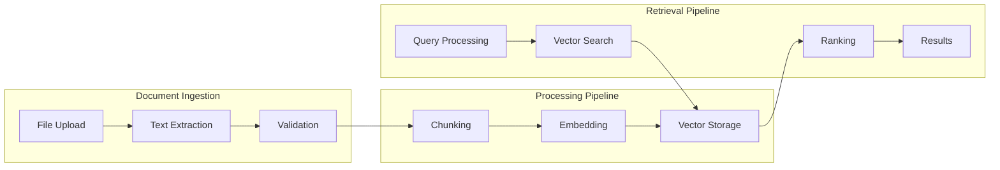

**Pipeline Stages:**
1. **Document Ingestion**: File upload, text extraction, validation
2. **Processing**: Chunking, embedding generation, vector storage
3. **Retrieval**: Query processing, vector search, result ranking

## 🔄 **Data Flow**

### **1. Document Upload Flow**

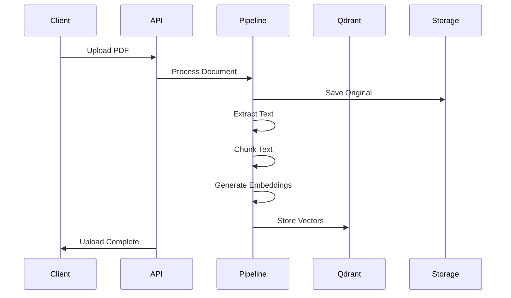

### **2. Chat/RAG Flow**

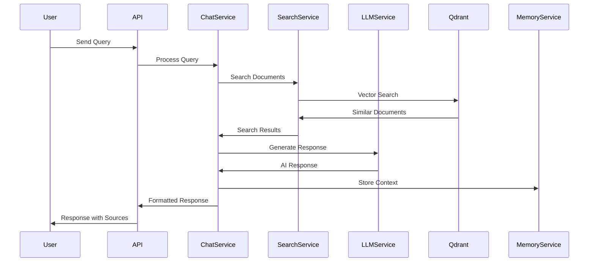

### **3. Multi-Agent Workflow**

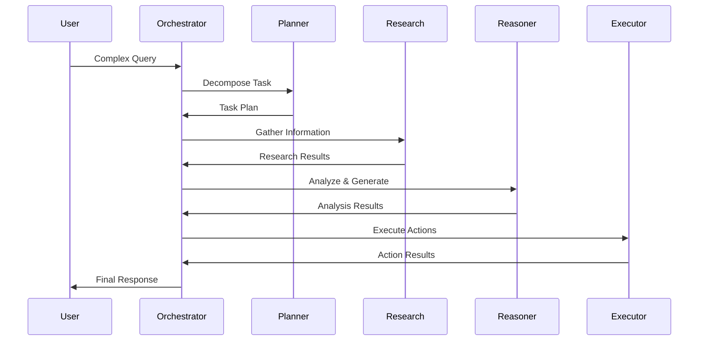

## 🤖 **Multi-Agent System**

### **Agent Workflow**

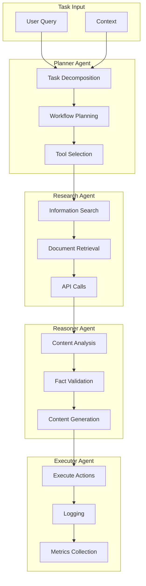

### **Agent Communication**

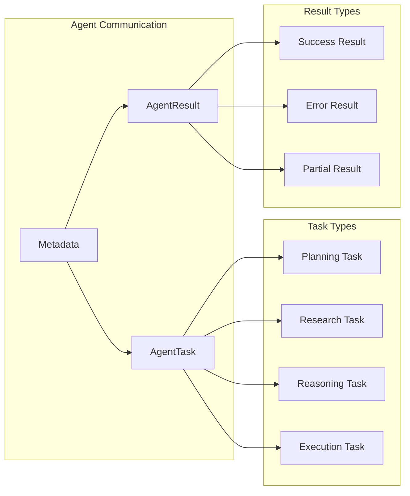

## 🔒 **Security Architecture**

### **Security Layers**

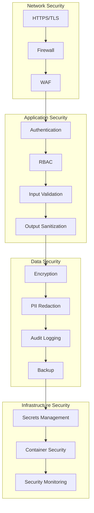

### **Authentication Flow**

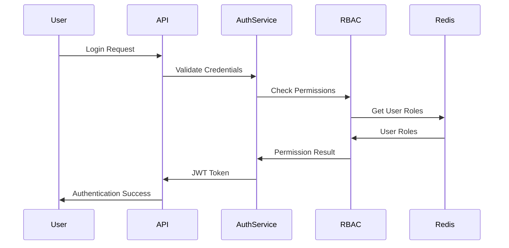

## 🚀 **Deployment Architecture**

### **Docker Deployment**

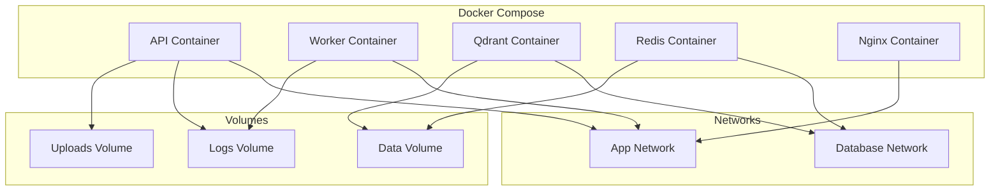

### **Kubernetes Deployment**

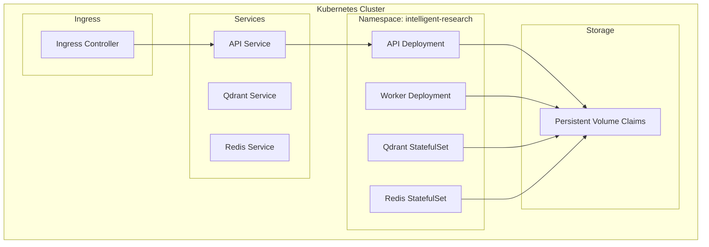

## ⚡ **Performance Considerations**

### **Scalability Strategy**

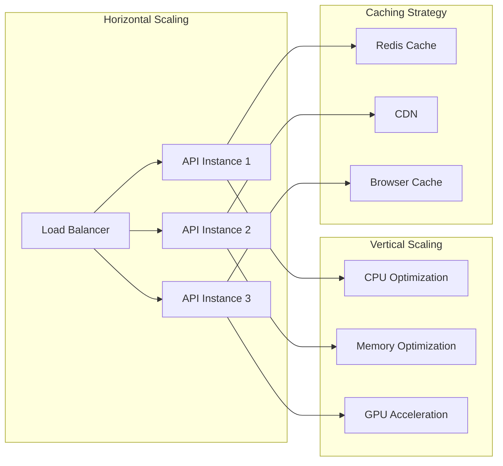

### **Performance Metrics**

| Component | Target Performance | Monitoring |
|-----------|-------------------|------------|
| **API Response** | <200ms | Response time, throughput |
| **Vector Search** | <100ms | Query latency, accuracy |
| **Document Processing** | 100+ pages/min | Processing speed, error rate |
| **Chat Response** | <2s | Response time, user satisfaction |
| **System Uptime** | 99.9% | Availability, MTTR |

### **Optimization Techniques**

1. **Caching Strategy**
   - Redis for session data and API responses
   - CDN for static assets
   - Browser caching for UI resources

2. **Database Optimization**
   - Connection pooling
   - Query optimization
   - Indexing strategies

3. **AI/ML Optimization**
   - Model quantization
   - Batch processing
   - GPU acceleration

4. **Network Optimization**
   - Compression
   - Connection pooling
   - Load balancing

---

## 📊 **Architecture Decisions**

### **Technology Choices**

| Component | Technology | Rationale |
|-----------|------------|-----------|
| **Web Framework** | Flask | Lightweight, flexible, Python-native |
| **Vector Database** | Qdrant | High performance, Python SDK, cloud-ready |
| **Cache** | Redis | Fast, reliable, feature-rich |
| **Containerization** | Docker | Standard, portable, scalable |
| **Orchestration** | Kubernetes | Production-ready, auto-scaling |
| **Security** | JWT + RBAC | Industry standard, flexible |

### **Design Principles**

1. **Modularity**: Each component is independently deployable
2. **Scalability**: Horizontal and vertical scaling support
3. **Security**: Defense in depth with multiple security layers
4. **Observability**: Comprehensive logging and monitoring
5. **Maintainability**: Clean code, documentation, testing
6. **Performance**: Optimized for AI/ML workloads

---

*This architecture provides a solid foundation for building a production-ready AI research platform with enterprise-grade security, scalability, and maintainability.* 